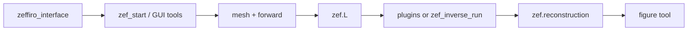

# Zeffiro Interface

Finite-element multiphysics brain modeling with EEG/MEG/EIT/TES forward solvers and a broad inverse toolbox (MNE, eLORETA, IAS, RAMUS, beamforming, Kalman, SESAME, etc.). The codebase mixes a **GUI runtime** (`src/`, `tools/plugins/`) with **refactored MATLAB packages** (`+core`, `+inverse`, `+utilities`, `+examples`, `+tests`).

## Folder purpose

Repository root: **startup**, path configuration, bundled data, profiles, and package namespaces. All user sessions begin at `zeffiro_interface.m`.

## Main contents

| Path | Role |
|------|------|
| `zeffiro_interface.m` | Main entry: paths, `zef` struct, GUI or nodisplay, CLI import/save/export |
| `zeffiro_setup.m` | Submodules, `zef_start_config.m` |
| `src/` | Procedural `zef_*` runtime (~557 `.m`): GUI, mesh, forward, inverse orchestration |
| `+core/` | Types, electrode I/O, menu callback, preconditioners |
| `+inverse/` | Class-based inverters (`inverse.*Inverter`) |
| `+utilities/` | Cluster dispatch, converters (BST/FS/Duneuro/SN), dev tools |
| `+examples/` | Examples and study scripts |
| `+plugins/` | ClassGMM, ClassKF for class inverters |
| `+tests/` | `matlab.unittest` suite |
| `tools/plugins/` | Legacy GUI plugins (39 packages) |
| `profile/` | INI-driven profiles and plugin menus |
| `data/` | Segmentations, example projects, electrodes, logs |
| `assets/` | `.fig` and PNG GUI assets |
| `documentation/` | LaTeX technical docs |
| `external/` | Optional third-party git submodules (upstream docs) |
| `scripts/` | Developer scripts (e.g. doc pass tooling) |

## Code functionality

**Startup:** `addpath(src/core)` → `zef_close_all` → `addpath(projectRoot)` + `genpath(src)` + plugins + profile + assets → `zef_start` → tools → optional `zef_load(default_project.mat)`.

**Forward:** mesh (`src/mesh`) → lead field (`src/forward`) → `zef.L`.

**Inverse (two tracks):**
- **GUI:** plugin `*_iteration` → `zef.reconstruction`
- **Programmatic:** `zef_inverse_run` → `utilities.cluster.dispatch_inverse` → `+inverse`

**State:** `zef` struct in MATLAB base workspace; GUI handles as `zef.h_*`.

## Workflow context



See `src/README.md`, `+inverse/README.md`, `tools/plugins/README.md` for depth.

## Usage instructions

```matlab
% Interactive
zef = zeffiro_interface;

% Batch-friendly
zef = zeffiro_interface('start_mode', 'nodisplay', ...
    'import_to_new_project', fullfile(pwd,'data','segmentations',...
    'multicompartment_head_project','import_segmentation.zef'));

% Class inverse
[zef, r] = zef_inverse_run(zef, 'eloreta', 'execution', 'local');

% Tests
runtests('+tests');
```

## Important notes

- **`src/core` ≠ `+core`** — lifecycle vs refactored package.
- **`default_project.mat`** is configured but often missing in fresh clones.
- Default profile: `multicompartment_head` (`profile/zeffiro_interface.ini`).
- Class inverters are not yet wired to most inverse menu buttons — plugins remain legacy.
- `external/` is third-party — do not rewrite vendor docs here.

## Developer guidance

- Every major folder has a **`README.md`** (7-section technical template) maintained from code inspection.
- Extend solvers in `+inverse` + registry; avoid new per-frame loops in plugins.
- Run `runtests('+tests')` before merging inverse or cluster changes.
- Package calls: `core.*`, `inverse.*`, `utilities.*` with project root on path only.
